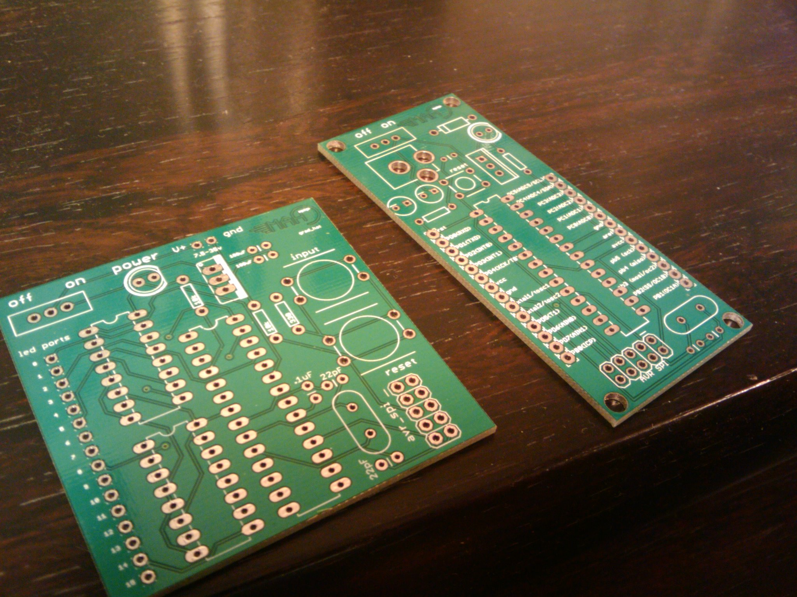
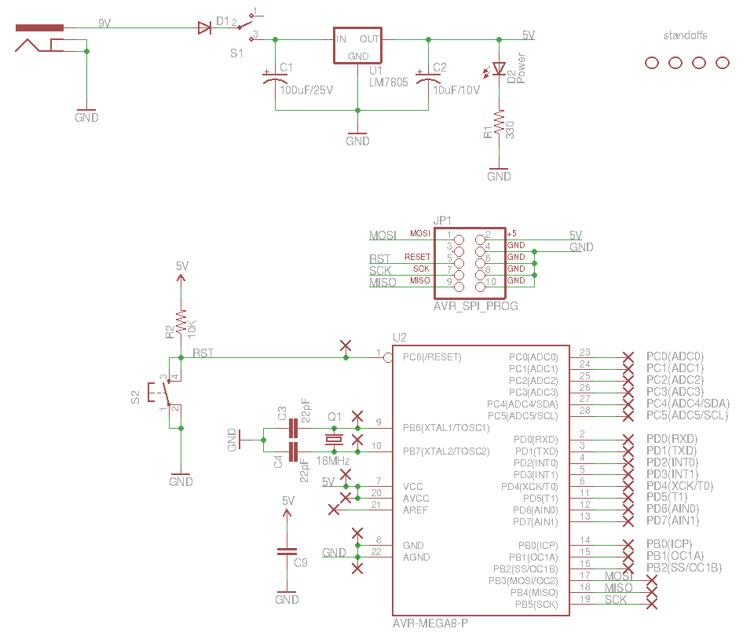

# atmega8-bare-bones

Bare bones dev board for the AVR Atmega8

(the one on the right)

It's essentially a blank canvas.  In addition to breaking out all of the
Atmega8 headers, there's a 16MHz external crystal oscillator, some basic
power circuitry, and an AVR SPI programming header.

